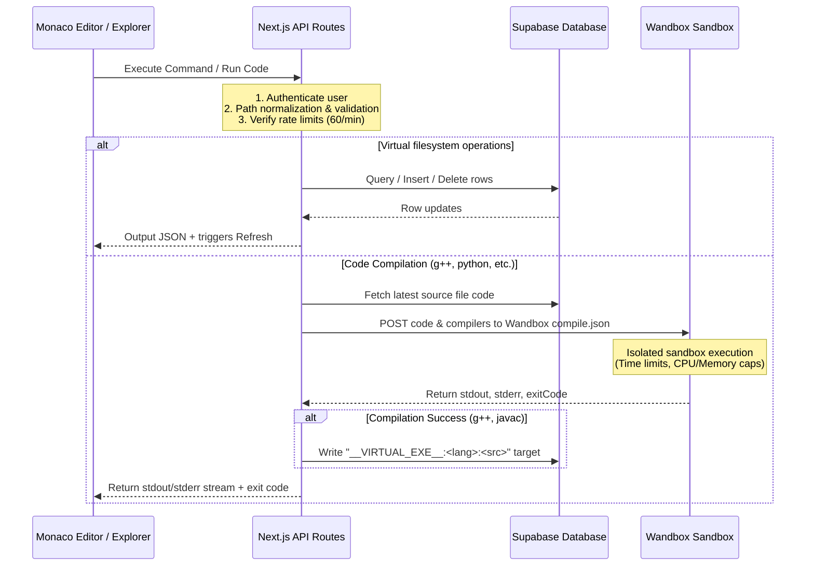
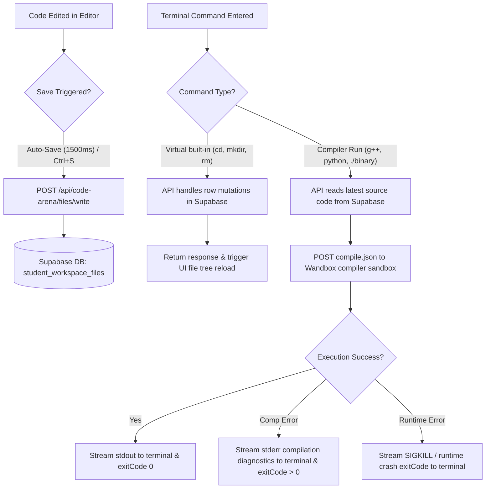
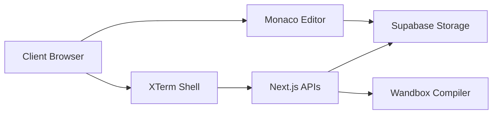
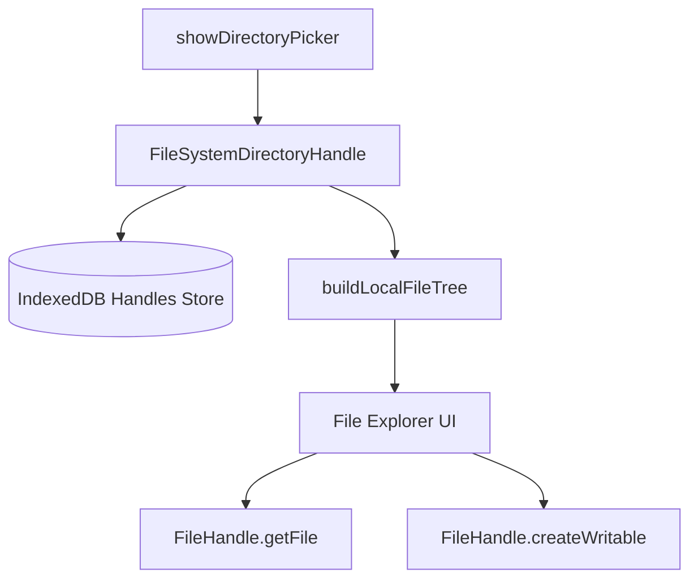

# Smart Learn Code Arena Compiler: Technical Architecture & Documentation

This document provides a comprehensive end-to-end technical reference for the BCE Code Arena Compiler, Sandbox Explorer, and Browser Shell. It audits the existing codebase, APIs, storage schemas, and security integrations.

---

## 1. Overview
The **Code Arena Compiler** is a web-based integrated development environment (IDE) and persistent terminal workspace. It allows students to write, compile, and run code in multiple programming languages directly in their browser, using either a persistent cloud-backed database workspace or a local PC directory.

### Key Capabilities
*   **Virtual Browser Shell:** A terminal interface supporting standard Unix filesystem utilities (`cd`, `ls`, `mkdir`, `rm`, etc.) and compilers (`g++`, `javac`, `python`, etc.).
*   **Persistent Cloud Filesystem:** Real-time database-backed workspace that preserves files, directory structures, active documents, and shell settings across browser refreshes and device swaps.
*   **Local PC Filesystem Picker:** Full directory mounting using the browser's File System Access API, enabling edits directly on local source files with complete read/write capability.
*   **Isolated Code Execution:** Compilation and execution powered by the Wandbox remote compiler backend with rate-limiting, timeout limits, and sandbox isolation.

### Compiler Execution & Flow Diagram


---

## 2. Tech Stack

The Code Arena compiler is integrated into a Next.js App Router project using these core dependencies:

| Package / Library | Version | Purpose |
| :--- | :--- | :--- |
| **`next`** | `16.2.9` | Core App Router serverless api and page routing framework |
| **`react`** / **`react-dom`** | `19.2.4` | Component management and visual workspace rendering |
| **`@monaco-editor/react`** | `^4.7.0` | Powers the web code editor (IntelliSense, syntax highlighting) |
| **`xterm`** | `^5.3.0` | Browser terminal emulator rendering the dark shell theme |
| **`xterm-addon-fit`** | `^0.8.0` | Auto-resizes the xterm terminal wrapper to fit inside layout tabs |
| **`@supabase/supabase-js`** | `^2.108.2` | DB client connecting API routes to Supabase tables |
| **`lucide-react`** | `^1.23.0` | Premium UI vectors for files, directory, and workspace switcher |

### Storage & Execution Providers
*   **Wandbox API (`https://wandbox.org/api/compile.json`):** Evaluates compiled and interpreted programs inside isolated container execution environments.
*   **Browser File System Access API:** Exposes native folder picker tools using standard Chromium directory structures (`FileSystemDirectoryHandle`).
*   **IndexedDB (`BCELocalFolderDB`):** Serializes browser filesystem directory handles so local folder associations survive page reloads.
*   **SessionStorage:** Tab-scoped cache for transient active file pathing, dirty editor inputs, and terminal command histories.

---

## 3. Supported Languages

The execution engine translates virtual shell compile/run requests into remote sandbox queries with these settings:

| Language | Ext | Engine | Compiler Target | Compile Command | Run Command | Input (stdin) |
| :--- | :--- | :--- | :--- | :--- | :--- | :--- |
| **C++17** | `.cpp`, `.cc` | GCC | `gcc-head` | `g++ main.cpp -o main` | `./main` | Supported (Ctrl+D EOF) |
| **C** | `.c` | GCC | `gcc-head-c` | Compiled in execution | Single-run request | Supported |
| **Java** | `.java` | OpenJDK | `openjdk-jdk-21+35` | `javac Main.java` | `java Main` | Supported |
| **Python** | `.py` | CPython | `cpython-3.12.7` | N/A | `python solve.py` | Supported |
| **JavaScript** | `.js` | Node.js | `nodejs-20.17.0` | N/A | `node script.js` | Supported |
| **HTML/React** | `.html` | Browser | Client Renderer | N/A | Embedded Iframe UI | Real-time |

*Known Limitations:* Wandbox does not support persistent stateful server sockets or interactive stdin. BCE resolves this by capturing all stdin lines in the browser console first, then forwarding the complete buffer to the execution endpoint when the user triggers EOF using **Ctrl+D**.

---

## 4. Complete Execution Flow



---

## 5. Storage Architecture

Workspace configurations are split between two independent persistent storage modes:

```
[Browser Session Cache] ──> sessionStorage (active file path, unsaved edits, cmd history)
                                 │
         ┌───────────────────────┴───────────────────────┐
         ▼                                               ▼
[Cloud Storage Mode]                             [Local Storage Mode]
Supabase PostgreSQL DB                           IndexedDB Local Handles Store
└─ Table: student_workspace_files                └─ Db: BCELocalFolderDB (root handle)
```

### Persistence Matrix
| Data Item | Technology | Storage Location | Survives Reload? | Survives Logout? | Survives Deploy? |
| :--- | :--- | :--- | :--- | :--- | :--- |
| **Cloud Files & Folders** | PostgreSQL | Supabase Table | Yes | Yes | Yes |
| **Local PC Files** | Local Disk | PC Filesystem | Yes | Yes (requires permit) | Yes |
| **Active Document** | sessionStorage | Web Browser Cache | Yes | No | Yes |
| **Unsaved Edits** | sessionStorage | Web Browser Cache | Yes | No | Yes |
| **Directory CWD** | sessionStorage | Web Browser Cache | Yes | No | Yes |
| **Command History** | sessionStorage | Web Browser Cache | Yes | No | Yes |
| **PC Directory Handle** | IndexedDB | Local Browser DB | Yes | Yes | Yes |

---

## 6. Browser Local Folder System

BCE implements Chromium's **File System Access API** to mount local PC directories directly inside the browser.

### Flow & Permission Lifecycle
1.  **Mounting:** The user clicks `Local PC Folder` -> `Open Local Folder`. This invokes `window.showDirectoryPicker()`.
2.  **Persistence:** The resulting `FileSystemDirectoryHandle` is stored in IndexedDB under `BCELocalFolderDB` -> `handles` store -> `'root'` key.
3.  **Restoration on Page Reload:** 
    *   BCE reads the directory handle from IndexedDB.
    *   It queries permission: `await handle.queryPermission({ mode: 'readwrite' })`.
    *   If permission is `'prompt'`, it displays a **Grant Access** button. Clicking this triggers the browser permission dialog (requires user gesture).
    *   If permission is `'granted'`, the local tree is loaded recursively.
4.  **Security boundary:** PC filesystem access is fully local to the browser. Local source code is never synced or uploaded to Supabase, protecting local intellectual property.

---

## 7. Virtual Workspace

The virtual shell operates on a mock filesystem root denoted by `~/workspace`.

### Path Normalization & Protection
Paths received by APIs are parsed through `cleanAndValidatePath()` in `src/features/code-arena/workspace-db.ts`:
1.  Prefixes like `~/workspace` or `/workspace` are stripped.
2.  Backslashes are standardized to forward slashes `/`.
3.  Segments are parsed into an array. If `..` is found, a segment is popped. If popping escapes the root (array underflow), a **"Path traversal escape attempt detected"** error is thrown, aborting the database lookup.
4.  Standard database paths are relative, e.g., `CP/Leetcode/main.cpp`.

---

## 8. Terminal

Terminal utility commands are implemented as virtual built-ins or execution runners:

*   **Virtual Built-ins (Database Mutations):**
    *   `pwd`: Prints `/workspace${cwd ? '/' + cwd : ''}\n`.
    *   `cd <dir>`: Validates existence of directory in the database and updates `cwd` session.
    *   `ls` / `ls -la`: Queries database rows, filters immediate children, and prints permissions, timestamps, sizes, and names.
    *   `mkdir <dir>`: Inserts a `directory` row.
    *   `touch <file>`: Inserts an empty `file` row.
    *   `cat <file>`: Fetches content from the database.
    *   `echo "text" > file`: Upserts a file with the given content.
    *   `cp` / `mv` / `rm`: Performs copy, rename, or delete mutations on the database.
*   **Sandboxed execution commands:**
    *   `g++ <src> -o <target>`: Verifies `<src>` exists, sends it to Wandbox. On compile success, inserts a virtual executable marker row `__VIRTUAL_EXE__:cpp17:<src>` at `<target>`.
    *   `./<target>`: Verifies the virtual binary target, reads the referenced source file, and runs it on Wandbox with any stdin.
    *   `python <src>`, `javac <src>`, `java <class>`, `node <src>`: Same execution routing.

---

## 9. API Documentation

All Code Arena APIs require authentication.

### `GET /api/code-arena/files/tree`
*   **Auth:** Requires authenticated student session.
*   **Response:** `{ files: ClientFileItem[] }`
*   **DB Action:** Fetches all files for `student_id = auth.uid()` and builds the tree. Automatically initializes default files if 0 rows are returned.

### `GET /api/code-arena/files/read`
*   **Query:** `?path=CP/main.cpp`
*   **Response:** `{ content: string }`
*   **DB Action:** Selects content from `student_workspace_files` where path matches.

### `POST /api/code-arena/files/write`
*   **Body:** `{ path: string, content: string }`
*   **Response:** `{ success: true }`
*   **DB Action:** Upserts file row.

### `POST /api/code-arena/files/create`
*   **Body:** `{ path: string, kind: 'file' | 'directory' }`
*   **Response:** `{ success: true }`
*   **DB Action:** Inserts a new row if it doesn't already exist.

### `POST /api/code-arena/files/rename`
*   **Body:** `{ oldPath: string, newPath: string }`
*   **Response:** `{ success: true }`
*   **DB Action:** Renames the item. For directories, recursively renames paths of all matching children.

### `POST /api/code-arena/files/delete`
*   **Body:** `{ path: string }`
*   **Response:** `{ success: true }`
*   **DB Action:** Deletes the row. For directories, recursively deletes all child rows matching path prefix.

### `POST /api/code-arena/files/reset`
*   **Body:** N/A
*   **Response:** `{ success: true }`
*   **DB Action:** Deletes all user rows and initializes default starters.

### `POST /api/code-arena/terminal/execute`
*   **Body:** `{ command: string, cwd: string, stdin?: string }`
*   **Response:** `{ stdout: string, stderr: string, exitCode: number, cwd: string }`
*   **Action:** Dispatches the command to virtual utilities or executes code via Wandbox.

---

## 10. Security Controls

1.  **Authentication:** All routes run `getCodeArenaActor()`, which uses Supabase to parse headers and retrieve the authenticated profile.
2.  **Row Level Security (RLS):** 
    `student_workspace_files` enforces RLS:
    `CREATE POLICY ... USING (student_id = auth.uid()) WITH CHECK (student_id = auth.uid());`
3.  **Command Injection Prevention:** Commands are parsed inside a custom server-side tokenizer. We do not use shell expansion, subprocess spawning, or `child_process.exec()` on Vercel. 
4.  **Sandbox Isolation:** Wandbox compiles code in isolated containers with blocked system calls and restricted local network operations.
5.  **Execution Limits:** Wandbox enforces execution timeout caps (typically 2000-5000ms) and prevents infinite loop forks. Rate-limits (60 compilation requests/min per user) prevent API spam.

### Security TODOs
*   Add request payload size caps to the write endpoint to prevent database bloat from large files.

---

## 11. Database Schema

### `public.student_workspace_files`
```sql
CREATE TABLE public.student_workspace_files (
  id UUID PRIMARY KEY DEFAULT gen_random_uuid(),
  student_id UUID NOT NULL REFERENCES public.profiles(id) ON DELETE CASCADE,
  path TEXT NOT NULL,
  kind TEXT NOT NULL CHECK (kind IN ('file', 'directory')),
  content TEXT NOT NULL DEFAULT '',
  created_at TIMESTAMPTZ NOT NULL DEFAULT NOW(),
  updated_at TIMESTAMPTZ NOT NULL DEFAULT NOW(),
  UNIQUE(student_id, path)
);

CREATE INDEX idx_student_workspace_files_lookup ON public.student_workspace_files(student_id, path);
```

---

## 12. File Explorer & Editor Integration

Synchronization across panels is handled through event triggers and callback loops:

```
┌────────────────────────────────────────────────────────┐
│                        Terminal                        │
└───────────────────────────┬────────────────────────────┘
                            │ OnCommandComplete()
                            ▼
┌────────────────────────────────────────────────────────┐
│                   PersonalCompiler                     │
│               - refreshExplorer()                      │
│               - setFiles(reconciledTree)               │
└───────────────┬────────────────────────┬───────────────┘
                │                        │
                ▼                        ▼
┌───────────────────────┐        ┌───────────────────────┐
│     File Explorer     │        │     Monaco Editor     │
│   (re-renders tree)   │        │ (updated save status) │
└───────────────────────┘        └───────────────────────┘
```

1.  **Save Flow:** Save command -> writes to database or local disk -> sets `isDirty: false` -> clears tab dirty cache.
2.  **Terminal Sync:** When a terminal execution command finishes, it calls `onCommandComplete()`. This triggers `refreshExplorer()`, which re-fetches the files and updates the tree in real time.
3.  **Selection Sync:** Double-clicking a file in the explorer tree reads its contents and opens it in the editor.

---

## 13. Performance

*   **Debounced Save:** Code edits trigger a debounced save (1500ms delay) to prevent database rate-limiting and save server resources.
*   **Stateless API Design:** No state is preserved on Vercel backend instances.
*   **Signature Caching:** Signature hashes for competitive coding problems are cached on the server to speed up code validation checks.

---

## 14. Error Handling

*   **Compilation Failure:** Renders stderr output (warnings and error positions) in red.
*   **Runtime Failure:** Captures stderr crashes and sets the appropriate status message (e.g. exit code 139 for segfaults).
*   **Timeout:** Returns `TIME_LIMIT_EXCEEDED` status if execution exceeds the execution limits.
*   **Process Disconnected:** If the terminal loses connectivity or the backend execution fails to respond, it aborts the fetch request, prints `Process terminated` to the console, and returns to the prompt.

---

## 15. Deployment

*   **Vercel / Serverless:** The workspace backend is designed to run in serverless environments. All workspace files are stored in Supabase, and compiler commands are sent to Wandbox. There is no dependency on local processes, temp folders, or serverless memory, making it 100% production-safe.
*   **Local Development:** Works out-of-the-box by reading credentials from `.env.local` to connect to Supabase.

---

## 16. Diagrams

### Overall Architecture


### Local PC Folder Flow


---

## 17. Developer Guide

### How to Add a Terminal Command
1.  Open [route.ts](file:///d:/Institute/BCE/src/app/api/code-arena/terminal/execute/route.ts).
2.  Add a new case in the dispatcher `switch (primaryCmd)`:
    ```typescript
    case 'whoami':
      return NextResponse.json({ stdout: 'student\n', stderr: '', exitCode: 0, cwd });
    ```

### How to Debug Execution
Use the debug utility to log latency metrics:
```typescript
const start = Date.now();
// execution code...
console.log(`Execution completed in ${Date.now() - start}ms`);
```

---

## 18. Configuration

```bash
NEXT_PUBLIC_SUPABASE_URL=<required>      # Supabase URL for DB queries
NEXT_PUBLIC_SUPABASE_ANON_KEY=<required> # Anon access token
SUPABASE_SERVICE_ROLE_KEY=<optional>     # Service role bypass credentials
DATABASE_URL=<required>                  # Direct postgres connection string
```

---

## 19. Known Limitations

*   **Currently Implemented:** Persistent browser terminals, remote compilation, browser file system picker integration.
*   **Partially Implemented:** Custom testcase batch evaluation via `judgeService`.
*   **Planned:** Multi-file compilation support for complex local projects.

---

## 20. Codebase Entry Points

For developers maintaining or extending the compiler system, these are the primary entry files:

*   **Backend Virtual Filesystem service:** [workspace-db.ts](file:///d:/Institute/BCE/src/features/code-arena/workspace-db.ts)
*   **Terminal command router:** [route.ts](file:///d:/Institute/BCE/src/app/api/code-arena/terminal/execute/route.ts)
*   **Code compiler proxy router:** [route.ts](file:///d:/Institute/BCE/src/app/api/coding/execute/route.ts)
*   **Workspace explorer layout:** [PersonalCompiler.tsx](file:///d:/Institute/BCE/src/features/code-arena/components/PersonalCompiler.tsx)
*   **Shell xterm renderer:** [TerminalWorkspace.tsx](file:///d:/Institute/BCE/src/features/code-arena/components/TerminalWorkspace.tsx)
*   **Database migration schema:** [124_code_arena_student_workspace_files.sql](file:///d:/Institute/BCE/supabase/migrations/124_code_arena_student_workspace_files.sql)
