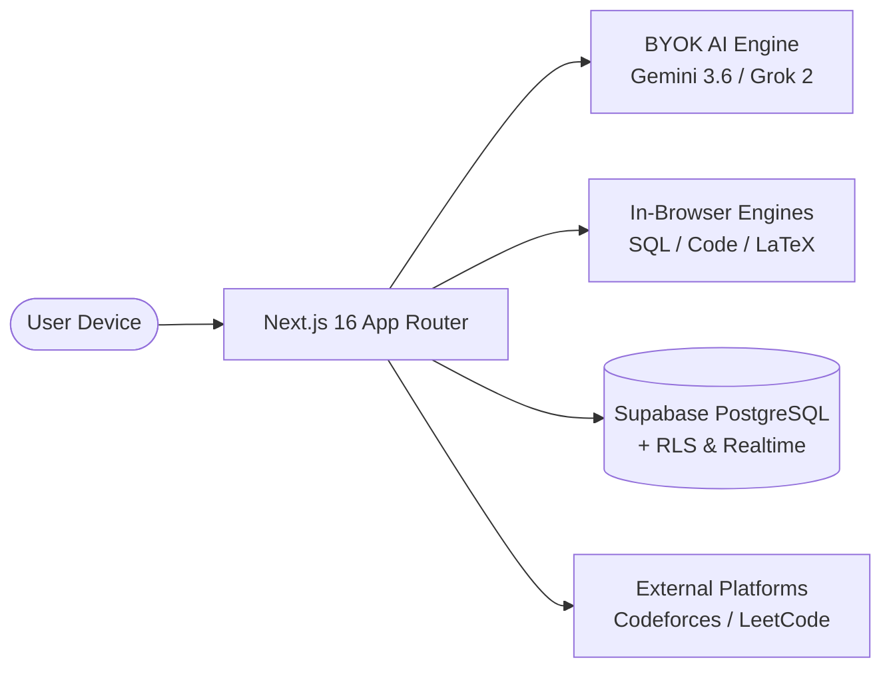

# 01. System Overview & Core Objectives

STATUS: ✅ IMPLEMENTED

## System Purpose
Smart Learn is an advanced, AI-native multi-tenant learning management and coding platform built for academic institutions. It provides real-time AI mentoring, interactive coding arenas, in-browser execution engines (SQL, Code, LaTeX), adaptive analytics, daily routine tracking, and multi-role administration.

## Core Architectural Pillars
1. **AI Agent & BYOK Subsystem**: Multi-provider support (Google Gemini & xAI Grok) with AES-256 encrypted per-user keys, speech VAD, and live DOM page awareness.
2. **In-Browser Execution Engines**: Pure JavaScript SQL lexer/parser/executor, Monaco Code Judge with testcase harnesses, and LaTeX document compilation.
3. **Institutional Multi-Tenancy & RBAC**: Tenant domain resolution, role-based dashboards (`guest`, `student`, `instructor`, `admin`, `super_admin`, `developer`), and RLS security.
4. **Gamified Student 360 Analytics**: Weakness identification engines, recommendation systems, daily routine stopwatches, and cross-platform coding rank synchronization.

## Technology Stack Summary
- **Frontend Framework**: Next.js 16.2.9 (React 19, Turbopack, App Router)
- **Styling**: Vanilla CSS Modules & Utility CSS (`src/styles/`)
- **Backend & Database**: Supabase PostgreSQL with 134 Migrations, RLS & Triggers
- **State & Realtime**: Supabase Realtime Channels & React Context State
- **AI SDK**: `@google/genai`, xAI Grok REST API
- **Execution & Editors**: Monaco Editor, KaTeX, WebSpeech API

