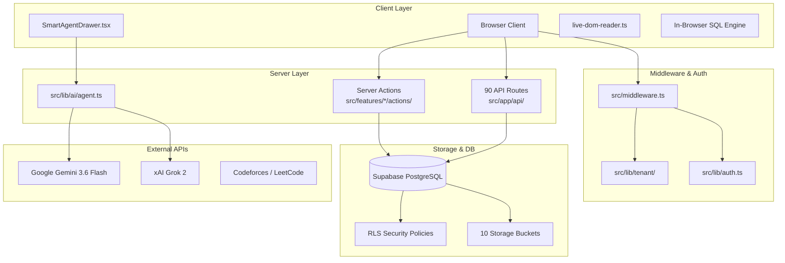

# 02. High-Level Architecture

STATUS: ✅ IMPLEMENTED

## Overview
Smart Learn follows a modern Next.js App Router architecture leveraging Server Components, Client Contexts, Server Actions, API Routes, and Supabase BaaS.

