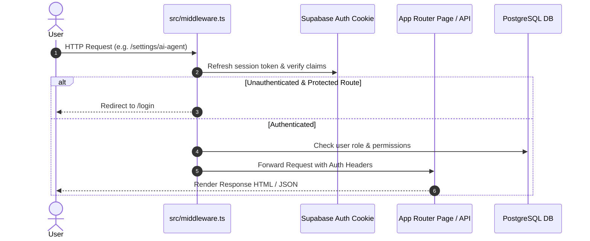

# 04. Application Flow & Lifecycle

STATUS: ✅ IMPLEMENTED

## Route Lifecycle & Middleware Interception
Every incoming HTTP request passes through `src/middleware.ts` for authentication and role verification before route execution.

