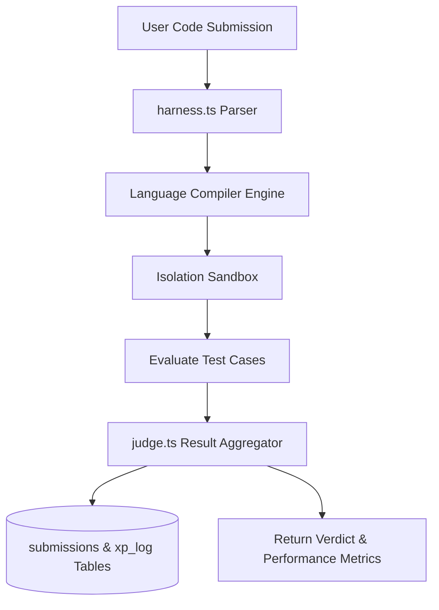

# 16. Code Editor & Execution Engine Architecture

STATUS: ✅ IMPLEMENTED

## System Purpose
Provides multi-language code editing, local file workspace management, testcase execution, problem judging, and competitive arena battles.

## Core Implementation Files
- **Execution Engine**: `src/features/code-arena/execution-engine.ts`
- **Harness Evaluator**: `src/features/code-arena/harness.ts`
- **Judge Subsystem**: `src/features/code-arena/judge.ts`
- **Workspace DB**: `src/features/code-arena/workspace-db.ts`
- **API Handler**: `src/app/api/coding/execute/route.ts`

