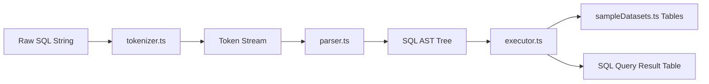

# 17. Pure JavaScript SQL Engine Architecture

STATUS: ✅ IMPLEMENTED

## System Purpose
An autonomous in-browser SQL Lexer, AST Parser, and Query Execution Engine running entirely inside client browser memory without backend database roundtrips.

## Core Implementation Files
- **Tokenizer / Lexer**: `src/lib/sql/tokenizer.ts`
- **AST Parser**: `src/lib/sql/parser.ts`
- **Execution Engine**: `src/lib/sql/executor.ts`
- **SQL Formatter**: `src/lib/sql/formatter.ts`
- **Sample Datasets**: `src/lib/sql/sampleDatasets.ts`
- **Types**: `src/lib/sql/types.ts`

