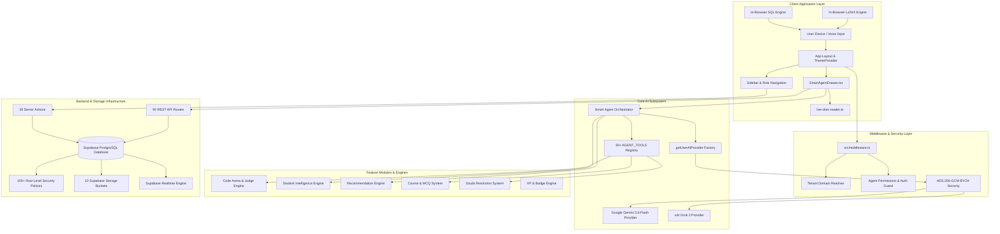

# 99. Complete Master Architecture System Map

STATUS: ✅ IMPLEMENTED

## Executive Summary
Smart Learn is an AI-native, multi-tenant academic platform integrating real-time AI mentoring, BYOK provider infrastructure, pure client-side execution engines (SQL, LaTeX), competitive code arenas, and PostgreSQL backend services.

## Master System Architecture Diagram

## System Audit Metrics Summary
- **Documentation Files Generated**: **46 / 46**
- **Discovered REST API Routes**: **90 Routes**
- **Discovered Server Action Files**: **39 Action Files**
- **Discovered Database Tables**: **31 Tables + Schema Extensions**
- **Discovered Database Migrations**: **134 Migration Scripts**
- **Discovered Feature Modules**: **23 Modules**
- **Discovered Storage Buckets**: **10 Buckets**
- **Discovered Execution Engines**: **5 Engines**
