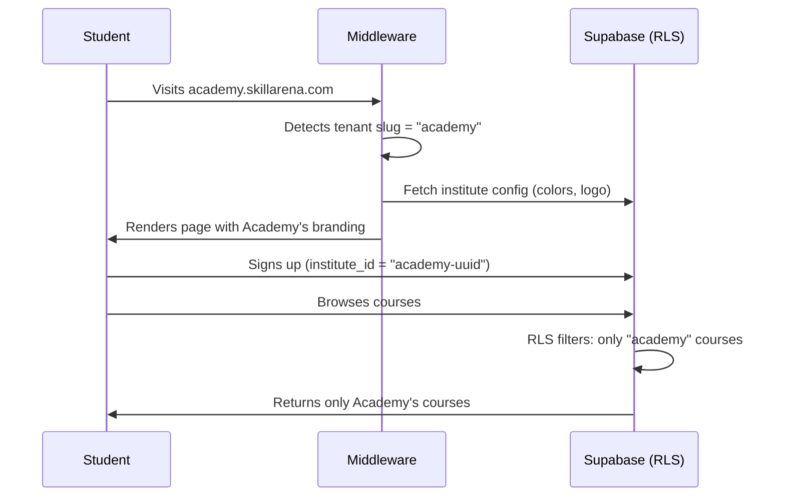
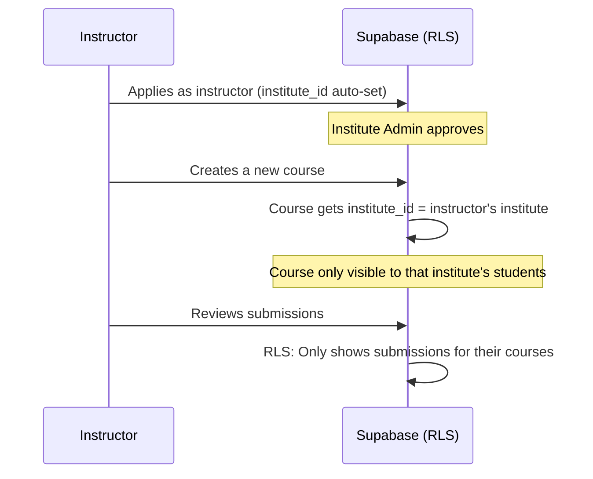
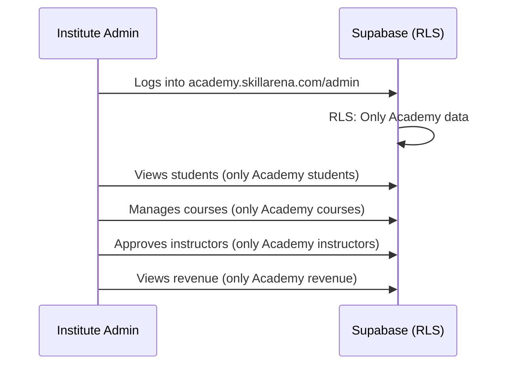

# Approach B: Multi-Tenant / Config-Driven (Single Repo + Single DB)

## Overview
We modify the existing SkillArena codebase so that it can serve **multiple institutes** from a single deployment. Each institute gets its own branding (colors, logo, name), its own isolated data (students, courses, enrollments), and its own admin — all powered by one codebase and one Supabase database using Row Level Security (RLS).

> [!TIP]
> **Best For:** Long-term scalability. If you plan to onboard 5, 10, 50+ institutes, this is the way. One bug fix → all institutes updated instantly.

## Open Questions

> [!IMPORTANT]
> 1. **Domain Strategy**: Should each institute have a subdomain (`academy.skillarena.com`) or a custom domain (`academy.com`)?
> 2. **For development**: Should we use URL path-based routing (`localhost:3000/academy/dashboard`) or subdomain-based (`academy.localhost:3000/dashboard`)?
> 3. **Feature Flags**: Should certain institutes get features others don't? (e.g., one institute gets leaderboard, another doesn't)
> 4. **Super Admin**: Should you (Aditya) be the only Super Admin, or should there be multiple?

---

## Phase 1: Database Architecture Changes

### Step 1.1 — Create the `institutes` table

Run this SQL in Supabase SQL Editor:

```sql
-- ==========================================
-- INSTITUTES (The core multi-tenant table)
-- ==========================================
CREATE TABLE institutes (
  id UUID PRIMARY KEY DEFAULT gen_random_uuid(),
  name TEXT NOT NULL,                          -- "CodeAcademy", "TechVidya"
  slug TEXT NOT NULL UNIQUE,                   -- "codeacademy", "techvidya" (used in URL)
  domain TEXT UNIQUE,                          -- Custom domain: "codeacademy.com" (optional)
  logo_url TEXT,
  icon_emoji TEXT DEFAULT '🎓',               -- Fallback icon
  tagline TEXT DEFAULT 'Learn. Build. Grow.',
  
  -- Theme Colors
  primary_color TEXT DEFAULT '#00f0ff',        -- Main accent (replaces --neon-cyan)
  secondary_color TEXT DEFAULT '#ff00e5',      -- Secondary accent (replaces --neon-magenta)
  bg_primary TEXT DEFAULT '#06060f',           -- Background
  bg_secondary TEXT DEFAULT '#0c0c1d',
  bg_card TEXT DEFAULT '#10102a',
  
  -- Settings
  is_active BOOLEAN DEFAULT true,
  allow_public_signup BOOLEAN DEFAULT true,    -- Can random people sign up?
  allow_instructor_applications BOOLEAN DEFAULT true,
  
  created_at TIMESTAMPTZ DEFAULT NOW(),
  updated_at TIMESTAMPTZ DEFAULT NOW()
);

-- Enable RLS
ALTER TABLE institutes ENABLE ROW LEVEL SECURITY;

-- Everyone can read active institutes
CREATE POLICY "Active institutes are public" ON institutes
  FOR SELECT USING (is_active = true);

-- Only super admins can manage institutes
CREATE POLICY "Super admins manage institutes" ON institutes
  FOR ALL USING (
    EXISTS (SELECT 1 FROM profiles WHERE id = auth.uid() AND role = 'admin' AND is_super_admin = true)
  );
```

### Step 1.2 — Add `institute_id` to ALL existing tables

```sql
-- Add institute_id column to every table
ALTER TABLE profiles ADD COLUMN institute_id UUID REFERENCES institutes(id);
ALTER TABLE courses ADD COLUMN institute_id UUID REFERENCES institutes(id);
ALTER TABLE enrollments ADD COLUMN institute_id UUID REFERENCES institutes(id);
ALTER TABLE submissions ADD COLUMN institute_id UUID REFERENCES institutes(id);
ALTER TABLE feedbacks ADD COLUMN institute_id UUID REFERENCES institutes(id);
ALTER TABLE notices ADD COLUMN institute_id UUID REFERENCES institutes(id);
ALTER TABLE xp_log ADD COLUMN institute_id UUID REFERENCES institutes(id);
ALTER TABLE badges ADD COLUMN institute_id UUID REFERENCES institutes(id);

-- Add super_admin flag to profiles
ALTER TABLE profiles ADD COLUMN is_super_admin BOOLEAN DEFAULT false;

-- Set yourself as super admin
UPDATE profiles SET is_super_admin = true WHERE email = 'adityakumarsah8709@gmail.com';
```

### Step 1.3 — Create a helper function for tenant isolation

```sql
-- Helper: Get the current user's institute_id
CREATE OR REPLACE FUNCTION get_user_institute_id() RETURNS UUID AS $$
BEGIN
  RETURN (SELECT institute_id FROM profiles WHERE id = auth.uid());
END;
$$ LANGUAGE plpgsql SECURITY DEFINER STABLE;

-- Helper: Check if user is super admin
CREATE OR REPLACE FUNCTION is_super_admin() RETURNS BOOLEAN AS $$
BEGIN
  RETURN EXISTS (
    SELECT 1 FROM profiles 
    WHERE id = auth.uid() AND is_super_admin = true
  );
END;
$$ LANGUAGE plpgsql SECURITY DEFINER STABLE;
```

### Step 1.4 — Update ALL RLS policies for tenant isolation

```sql
-- ==========================================
-- UPDATED RLS POLICIES (Tenant-Isolated)
-- ==========================================

-- PROFILES: Users can only see profiles from their institute (or super admin sees all)
DROP POLICY IF EXISTS "Profiles are viewable by everyone" ON profiles;
CREATE POLICY "Profiles are viewable within institute" ON profiles
  FOR SELECT USING (
    institute_id = get_user_institute_id() OR is_super_admin()
  );

-- COURSES: Only see courses from your institute
DROP POLICY IF EXISTS "Published courses viewable by everyone" ON courses;
CREATE POLICY "Published courses viewable within institute" ON courses
  FOR SELECT USING (
    (is_published = true AND institute_id = get_user_institute_id())
    OR is_admin()
    OR is_super_admin()
  );

-- ENROLLMENTS: Only see enrollments from your institute
DROP POLICY IF EXISTS "Users view own enrollments" ON enrollments;
CREATE POLICY "Users view own enrollments within institute" ON enrollments
  FOR SELECT USING (
    (auth.uid() = user_id AND institute_id = get_user_institute_id())
    OR is_admin()
    OR is_super_admin()
  );

-- SUBMISSIONS: Only see submissions from your institute
DROP POLICY IF EXISTS "Users view own submissions" ON submissions;
CREATE POLICY "Users view own submissions within institute" ON submissions
  FOR SELECT USING (
    (auth.uid() = user_id AND institute_id = get_user_institute_id())
    OR is_admin()
    OR is_super_admin()
  );

-- Repeat similar pattern for: feedbacks, notices, xp_log, badges
-- (Same logic: institute_id = get_user_institute_id() OR is_super_admin())
```

### Step 1.5 — Auto-assign institute_id on user signup

```sql
-- Update the signup trigger to assign institute_id
CREATE OR REPLACE FUNCTION public.handle_new_user()
RETURNS trigger AS $$
BEGIN
  INSERT INTO public.profiles (id, name, email, institute_id)
  VALUES (
    new.id,
    new.raw_user_meta_data->>'name',
    new.email,
    (new.raw_user_meta_data->>'institute_id')::UUID  -- Passed from the signup form
  );
  RETURN new;
END;
$$ LANGUAGE plpgsql SECURITY DEFINER;
```

---

## Phase 2: New Folder Structure & Code Changes

### Complete New Folder Structure

```text
skillarena/
├── .env.local                        # Single DB connection (unchanged!)
├── middleware.ts                      # MODIFIED: Adds tenant detection
├── src/
│   ├── config/
│   │   └── tenant.ts                 # NEW: Tenant context helpers
│   ├── lib/
│   │   ├── supabase/
│   │   │   ├── client.ts             # Unchanged
│   │   │   ├── server.ts             # Unchanged
│   │   │   └── middleware.ts         # MODIFIED: Passes tenant info
│   │   ├── constants.ts              # MODIFIED: Remove hardcoded SUPER_ADMIN_EMAIL
│   │   └── utils.ts                  # Unchanged
│   ├── components/
│   │   ├── providers/
│   │   │   └── TenantProvider.tsx    # NEW: React context for tenant branding
│   │   ├── layout/
│   │   │   ├── Sidebar.tsx           # MODIFIED: Uses tenant name instead of "SkillArena"
│   │   │   └── Navbar.tsx            # MODIFIED: Uses tenant branding
│   │   └── ...
│   ├── features/
│   │   ├── auth/
│   │   │   └── components/
│   │   │       └── SignupForm.tsx     # MODIFIED: Passes institute_id during signup
│   │   └── ...
│   ├── app/
│   │   ├── layout.tsx                # MODIFIED: Wraps children in TenantProvider
│   │   ├── page.tsx                  # MODIFIED: Uses tenant branding on landing
│   │   ├── (admin)/                  # Unchanged structure (RLS handles isolation)
│   │   ├── (instructor)/             # Unchanged structure
│   │   ├── (dashboard)/              # Unchanged structure
│   │   └── (super-admin)/            # NEW: Super Admin pages
│   │       └── super-admin/
│   │           ├── page.tsx           # Global dashboard (all institutes)
│   │           ├── institutes/
│   │           │   └── page.tsx       # Manage institutes (create/edit/delete)
│   │           └── layout.tsx         # Super admin layout with auth check
│   └── styles/
│       └── variables.css             # MODIFIED: Default values (overridden dynamically)
```

### 2.1 — Tenant Configuration Module

#### [NEW] `src/config/tenant.ts`
```typescript
export interface TenantConfig {
  id: string;
  name: string;
  slug: string;
  logoUrl: string | null;
  iconEmoji: string;
  tagline: string;
  primaryColor: string;
  secondaryColor: string;
  bgPrimary: string;
  bgSecondary: string;
  bgCard: string;
  allowPublicSignup: boolean;
  allowInstructorApplications: boolean;
}

// Fetch tenant config from Supabase based on slug or domain
export async function getTenantConfig(slugOrDomain: string): Promise<TenantConfig | null> {
  // Queries the `institutes` table
  // Returns the matching institute's branding config
}
```

### 2.2 — Tenant React Context Provider

#### [NEW] `src/components/providers/TenantProvider.tsx`
```tsx
'use client';
import { createContext, useContext } from 'react';
import type { TenantConfig } from '@/config/tenant';

const TenantContext = createContext<TenantConfig | null>(null);

export function useTenant() {
  const ctx = useContext(TenantContext);
  if (!ctx) throw new Error('useTenant must be used within TenantProvider');
  return ctx;
}

export default function TenantProvider({
  children,
  tenant,
}: {
  children: React.ReactNode;
  tenant: TenantConfig;
}) {
  // Inject CSS variables dynamically based on tenant config
  const tenantStyles = {
    '--neon-cyan': tenant.primaryColor,
    '--neon-magenta': tenant.secondaryColor,
    '--bg-primary': tenant.bgPrimary,
    '--bg-secondary': tenant.bgSecondary,
    '--bg-card': tenant.bgCard,
    '--gradient-xp': `linear-gradient(90deg, ${tenant.secondaryColor}, ${tenant.primaryColor})`,
    '--gradient-button': `linear-gradient(135deg, ${tenant.primaryColor}, ${tenant.secondaryColor})`,
  } as React.CSSProperties;

  return (
    <TenantContext.Provider value={tenant}>
      <div style={tenantStyles}>
        {children}
      </div>
    </TenantContext.Provider>
  );
}
```

### 2.3 — Middleware Changes (Tenant Detection)

#### [MODIFY] [middleware.ts](file:///d:/TechPlatform/skillarena/middleware.ts)
The middleware will now detect the tenant from the URL before processing authentication:

```typescript
import { type NextRequest } from 'next/server';
import { updateSession } from '@/lib/supabase/middleware';

export async function middleware(request: NextRequest) {
  const hostname = request.headers.get('host') || '';
  
  // Extract tenant slug from subdomain
  // e.g., "academy.skillarena.com" → "academy"
  // e.g., "localhost:3000" → "main" (default/development)
  const slug = hostname.split('.')[0];
  const isLocalhost = hostname.includes('localhost');
  const tenantSlug = isLocalhost ? 'main' : slug;
  
  // Pass tenant slug to the session handler via headers
  request.headers.set('x-tenant-slug', tenantSlug);
  
  return await updateSession(request);
}
```

---

## Phase 3: User Flows (How Each Role Works)

### 👨‍🎓 Student Flow


**What the Student sees:**
- Landing page with Academy's logo, colors, and name
- Only Academy's courses in the catalog
- Only Academy's students on the leaderboard
- Academy's branded sidebar and navbar

### 👨‍🏫 Instructor Flow


**What the Instructor sees:**
- Their institute's branded dashboard
- Only courses they created (within their institute)
- Only submissions from their institute's students
- Revenue analytics for their institute only

### 🛡️ Institute Admin Flow
Each institute has its own admin(s). They have `role = 'admin'` in the `profiles` table AND `is_super_admin = false`.



**What the Institute Admin sees:**
- Admin dashboard showing **only their institute's** data
- Students list → only their students
- Courses → only their courses
- Feedback → only their feedback
- Revenue → only their revenue
- **CANNOT** see other institutes or access super admin

### 🌐 Super Admin Flow (You — Aditya)
You have `is_super_admin = true`, which bypasses all RLS tenant filters.

#### [NEW] Super Admin Pages to Build:

| Page | Route | Purpose |
|:-----|:------|:--------|
| Global Dashboard | `/super-admin` | Total revenue across ALL institutes, total users, total courses |
| Manage Institutes | `/super-admin/institutes` | Create, edit, delete institutes. Set colors, logos, enable/disable |
| Create Institute | `/super-admin/institutes/new` | Form to onboard a new institute |
| Global Users | `/super-admin/users` | See ALL users across all institutes |

**What the Super Admin sees:**
- A meta-dashboard showing stats from every institute
- Ability to create a new institute (just fill a form → new tenant is live)
- Can switch into any institute's admin view
- Can see all revenue, all users, all courses globally

---

## Phase 4: How to Onboard a New Institute (After Setup)

Once Approach B is implemented, adding a new institute takes **5 minutes**:

### Step 1: Super Admin creates the institute
Go to `/super-admin/institutes/new` and fill the form:
```
Name: "TechVidya"
Slug: "techvidya"
Primary Color: "#ff6b00"
Secondary Color: "#ffd700"
Logo: (upload)
```

### Step 2: DNS Setup
Point `techvidya.skillarena.com` to your Vercel deployment.

### Step 3: Done!
`techvidya.skillarena.com` is now live with orange/gold branding, and a completely empty database ready for their students and instructors to sign up.

---

## Phase 5: Files to Modify (Summary)

### New Files to Create
| File | Purpose |
|:-----|:--------|
| `src/config/tenant.ts` | Tenant config types and fetch logic |
| `src/components/providers/TenantProvider.tsx` | React context + dynamic CSS injection |
| `src/app/(super-admin)/layout.tsx` | Super admin layout with auth guard |
| `src/app/(super-admin)/super-admin/page.tsx` | Global dashboard |
| `src/app/(super-admin)/super-admin/institutes/page.tsx` | Institute management |

### Existing Files to Modify
| File | Change |
|:-----|:-------|
| `middleware.ts` | Add tenant slug detection from hostname |
| `src/lib/supabase/middleware.ts` | Pass tenant slug header to page |
| `src/app/layout.tsx` | Wrap in `TenantProvider`, use dynamic metadata |
| `src/app/page.tsx` | Replace hardcoded "SkillArena" with `tenant.name` |
| `src/components/layout/Sidebar.tsx` | Replace "SkillArena" with `useTenant().name` |
| `src/components/layout/Navbar.tsx` | Use tenant branding |
| `src/features/auth/components/SignupForm.tsx` | Pass `institute_id` in signup metadata |
| `src/lib/constants.ts` | Remove hardcoded `SUPER_ADMIN_EMAIL` (use DB flag) |
| All `page.tsx` metadata | Dynamic title: `[tenant.name] \| Page Name` |

### Database Migrations to Run
| Migration | Purpose |
|:----------|:--------|
| `018_create_institutes.sql` | Create `institutes` table |
| `019_add_institute_id.sql` | Add `institute_id` to all tables |
| `020_tenant_rls_policies.sql` | Updated RLS policies with tenant isolation |
| `021_super_admin.sql` | Add `is_super_admin` flag, helper functions |

---

## Phase 6: Verification

### Automated Tests
```powershell
# Run the dev server
npm run dev

# Test default tenant (main site)
# Visit: http://localhost:3000 → should show original SkillArena branding

# Test a specific tenant
# You'll need to add a local hosts entry or use path-based routing for dev
```

### Manual Verification Checklist
- [ ] Default site (`localhost:3000`) shows original SkillArena branding
- [ ] Institute site shows custom branding (colors, logo, name)
- [ ] Student from Institute A cannot see Institute B's courses
- [ ] Institute Admin can only manage their own institute's data
- [ ] Super Admin can see all institutes and all data
- [ ] Creating a new institute from Super Admin panel works
- [ ] Signup correctly assigns `institute_id` to new users
- [ ] Instructor's courses are tagged with correct `institute_id`

---

## Summary: Total Effort

| Category | Effort | Estimated Time |
|:---------|:-------|:---------------|
| Database Migrations (4 new) | SQL files | 1 hour |
| Tenant Config + Provider | 2 new files | 1 hour |
| Middleware Changes | 2 files | 1 hour |
| Branding Modifications | ~12 files | 2 hours |
| Super Admin Pages | 3-4 new pages | 3-4 hours |
| Testing & Verification | Manual testing | 1-2 hours |
| **Total** | | **~9-11 hours** |

> [!WARNING]
> Approach B is significantly more complex than Approach A (~55 min vs ~10 hours), but it's a **one-time investment**. After it's built, onboarding each new institute takes only 5 minutes via the Super Admin panel, while Approach A would require 55 minutes of manual work per institute.
